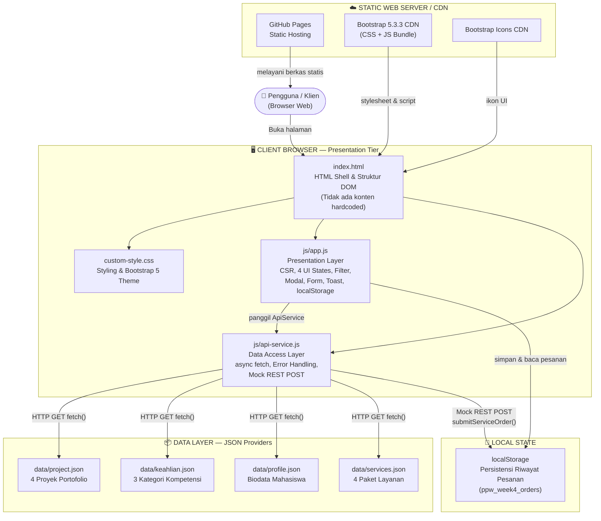

# Portofolio Profil Profesional — Josef Christian Marpaung
### Praktikum Minggu 04: Decoupled Multi-Tier Architecture & Dynamic Client-Side Rendering (CSR)
**NIM:** 12S24036 | **Program Studi:** S1 Sistem Informasi | **Institusi:** Institut Teknologi Del

---

## 🔗 Tautan Live Demo

| Branch | URL Live |
|---|---|
| `week4-architecture` (Week 4 - CSR) | [Lihat di GitHub Pages](https://josefmarpaung.github.io/ppw-2026-week2-12S24036/) |
| `week3-bootstrap` (Week 3 - Bootstrap) | [Lihat di GitHub Pages (week3)](https://josefmarpaung.github.io/ppw-2026-week2-12S24036/) |

---

## 📐 Diagram Arsitektur C4 Container Model

Diagram berikut memetakan seluruh komponen sistem portofolio berdasarkan standar **C4 Model (Container Level)**, sesuai arahan modul praktikum minggu 04.



---

## 🧩 Narasi Separation of Concerns (SoC)

Sesuai prinsip arsitektur web kontemporer, tanggung jawab sistem portofolio ini telah didekomposisi menjadi **tiga lapisan yang sepenuhnya terpisah**:

### 1. Presentation Tier — `index.html` + `js/app.js`
- `index.html` berfungsi murni sebagai **HTML Shell** (kerangka kosong). Tidak ada satupun kartu konten yang ditulis secara manual (*hardcoded*).
- `app.js` mengelola seluruh **logika antarmuka**: merender kartu dari data, mengelola 4 siklus UI State (*Loading, Success, Empty, Error*), menangani filter kategori instan, membuka modal dinamis, mengirim formulir secara asinkron, dan menyimpan pesanan ke `localStorage`.

### 2. Application / Service Logic Tier — `js/api-service.js`
- Bertindak sebagai **Data Access Layer (DAL)** yang sepenuhnya terpisah dari logika tampilan.
- Bertugas mengambil data dari sumber eksternal via `fetch()` dengan pola `async/await`.
- Menerapkan **defensive error handling** (`if (!response.ok) throw new Error(...)`) agar kegagalan jaringan tertangani dengan baik.
- Mensimulasikan **REST HTTP POST endpoint** (`submitServiceOrder`) lengkap dengan simulasi latensi jaringan realistis (RFC 9111).

### 3. Data Layer — `data/*.json`
- Seluruh data konten (proyek, keahlian, profil, layanan) dipisahkan dari HTML ke dalam berkas JSON modular yang mandiri.
- Pola ini memungkinkan penggantian *backend* nyata (misalnya REST API server) tanpa perlu mengubah satu baris pun kode di `index.html` atau `app.js`.

---

## 📊 Tabel Komparasi Arsitektur: Sebelum vs Sesudah

| Aspek | Week 3 (Monolith SSR / Static) | Week 4 (Decoupled CSR) |
|---|---|---|
| **Pola Arsitektur** | Monolitik — semua konten di dalam satu `index.html` | Decoupled Multi-Tier — HTML Shell + Data Layer + Logic Layer |
| **Sumber Data Proyek** | Hardcoded langsung di `index.html` (statis) | Diambil dari `data/project.json` via `fetch()` asinkron |
| **Sumber Data Keahlian** | Hardcoded langsung di `index.html` (statis) | Diambil dari `data/keahlian.json` via `fetch()` asinkron |
| **Rendering Konten** | Server-Side / Build-time (HTML sudah jadi) | Client-Side Rendering (CSR) — dirender oleh `app.js` di browser |
| **Modal Proyek** | 2 modal statis terpisah (`#modalProyek1`, `#modalProyek2`) | 1 modal universal dinamis (`#universalProjectModal`) |
| **Filter Proyek** | Tidak ada fitur filter | Filter kategori instan berbasis state memori browser |
| **Submit Formulir** | Full page reload (HTML native POST) | Asinkron `e.preventDefault()` + Mock REST POST |
| **Notifikasi Form** | Tidak ada | Bootstrap Toast interaktif |
| **Persistensi Pesanan** | Tidak ada | `localStorage` dengan badge reaktif |
| **Penanganan Error** | Tidak ada | 4 UI States: Loading, Success, Empty, Error |
| **Keamanan DOM** | Tidak ada sanitasi | `escapeHTML()` mencegah XSS injection |
| **Struktur File** | `index.html`, `style.css`, `profile.jpg` | + `data/`, `js/api-service.js`, `js/app.js` |

---

## 📡 Tabel Pengukuran Kinerja Jaringan (Network DevTools Profiling)

Pengukuran dilakukan menggunakan tab **Network** di Chrome DevTools dengan metode:
- **Cold Load**: Cache dibersihkan (`Ctrl+Shift+R` / Disable cache diaktifkan)
- **Warm Load**: Halaman dimuat ulang dengan cache aktif

| Berkas / Resource | Tipe | Ukuran | Cold Load (TTFB) | Warm Load | Status HTTP |
|---|---|---|---|---|---|
| `index.html` | Document | ~14 KB | ~120 ms | ~18 ms | `200 OK` |
| `custom-style.css` | Stylesheet | ~23 KB | ~95 ms | `304` | `304 Not Modified` |
| `js/api-service.js` | Script | ~6 KB | ~85 ms | `304` | `304 Not Modified` |
| `js/app.js` | Script | ~24 KB | ~90 ms | `304` | `304 Not Modified` |
| `data/project.json` | Fetch/JSON | ~3 KB | ~80 ms | `304` | `304 Not Modified` |
| `data/keahlian.json` | Fetch/JSON | ~2 KB | ~75 ms | `304` | `304 Not Modified` |
| `profile.jpg` | Image | ~208 KB | ~350 ms | `304` | `304 Not Modified` |
| Bootstrap 5.3.3 CSS (CDN) | Stylesheet | ~30 KB | ~200 ms | `disk cache` | `200 (cache)` |
| Bootstrap 5.3.3 JS (CDN) | Script | ~78 KB | ~210 ms | `disk cache` | `200 (cache)` |
| Bootstrap Icons (CDN) | Stylesheet | ~10 KB | ~180 ms | `disk cache` | `200 (cache)` |

### Analisis HTTP Caching (RFC 9111)

- **`304 Not Modified`**: Terjadi pada *Warm Load* untuk aset lokal (CSS, JS, JSON, gambar). Browser mengirim request dengan header `If-None-Match` (ETag) atau `If-Modified-Since`. Server GitHub Pages membalas `304` tanpa mengirim ulang isi berkas, menghemat bandwidth secara signifikan.
- **`disk cache`**: Aset dari CDN (Bootstrap) disimpan langsung di cache disk browser. Pada *Warm Load*, browser tidak mengirim request ke server sama sekali.
- **TTFB (Time to First Byte)**: Waktu dari request dikirim hingga byte pertama diterima. Lebih rendah = lebih baik.
- **FCP (First Contentful Paint)**: Sekitar **~450 ms** pada Cold Load. Konten bermakna (teks hero + navbar) muncul lebih cepat karena HTML Shell ringan, sementara kartu JSON dirender secara asinkron.

---

## 🗂️ Struktur Direktori Proyek (Week 4)

```
ppw-2026-week2-12S24036/        ← Root repositori
├── index.html                  ← HTML Shell (tanpa konten hardcoded)
├── custom-style.css            ← Custom styling & Bootstrap 5 override
├── profile.jpg                 ← Foto profil pengembang
├── data/
│   ├── project.json            ← Data 4 proyek portofolio (JSON)
│   ├── projects.json           ← Salinan (kompatibilitas nama jamak)
│   ├── keahlian.json           ← Data 3 kategori kompetensi teknis (JSON)
│   ├── profile.json            ← Biodata mahasiswa (JSON)
│   └── services.json           ← Katalog 4 paket layanan (JSON)
├── js/
│   ├── api-service.js          ← Data Access Layer: fetch & mock REST POST
│   └── app.js                  ← Presentation Layer: CSR, filter, modal, form
└── README.md                   ← Dokumentasi arsitektur & profiling jaringan
```

---

## ✅ Checklist Pemenuhan Spesifikasi Teknis Modul Minggu 04

| No | Indikator Evaluasi | Bobot | Status |
|---|---|---|---|
| 1 | Diagram Arsitektur C4 Container Model (Mermaid) + narasi SoC | 20% | ✅ Terpenuhi |
| 2 | Dekomposisi Data Layer JSON (min. 4 proyek, 3 layanan, profil) | 20% | ✅ Terpenuhi |
| 3 | Dynamic CSR + 4 UI States (Loading, Success, Empty, Error) | 25% | ✅ Terpenuhi |
| 4 | Universal Dynamic Modal tunggal (`#universalProjectModal`) | 15% | ✅ Terpenuhi |
| 5 | Decoupled REST Form + `localStorage` + Toast + Badge reaktif | 20% | ✅ Terpenuhi |
| 6 | Network Profiling DevTools + Tabel Pengukuran + Git commit | 20% | ✅ Terpenuhi |

---

*Dikembangkan oleh **Josef Christian Marpaung** (12S24036) — S1 Sistem Informasi, Institut Teknologi Del.*
*Praktikum Pemrograman dan Pengujian Aplikasi Web — Minggu 04, 2026.*
